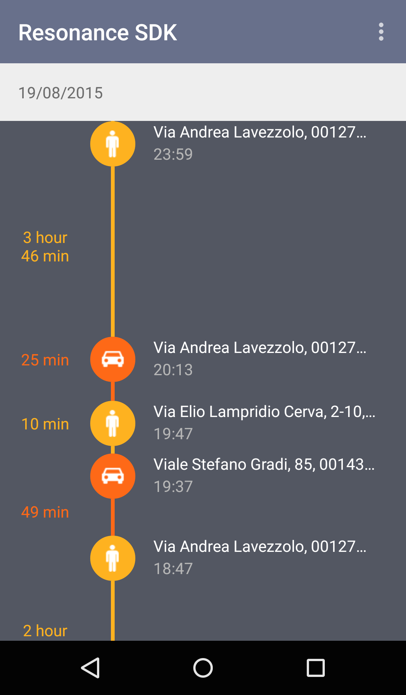

.. _activity:

Activity Tracking
=======================================

Resonance SDK comes with an integrated library for simplifying user activity detection. It has two main purposes:

1. Listening for event updates (e.g. user starts driving, user starts biking after walking, and so on).
2. Accessing information concerning tracked daily activities.

Following sections describe more in depth both features, providing detailed examples.

Theoretical Basis
---------------------------------------

The activity recognition task involves mapping time-series sensor data to a single physical user activity :ref:`[ Weiss2012 ] <activity-tracking-bib>`. The sensors used to perform this task are: accelerometers and gyroscopes. To achieve this task a number of signal processing algorithm and classification algorithms from the area of *Machine Learning* are used for example: *Naive Bayes*, *Decision Tree*, *K-Nearest Neighbor* and *Support Vector Machine* classifiers :ref:`[ Anjum2013 ] <activity-tracking-bib>`.

Google's API implement those methods in order to identify what type of activity is the user doing in a specific moment, categorizing them as: ``IN_VEHICLE``, ``ON_BICYCLE``, ``ON_FOOT``, ``WALKING``, ``RUNNING``, ``STILL``, ``TILTING``, ``UNKNOWN``. To improve the results we developed a system using filters and machine leraning; this system allows us to determine very precisely the activities carried on by the user, with confidence factor from *70%* to *100%*. 

.. _activity-tracking-events:

Monitoring Events
---------------------------------------

Activity tracker allows to listen for updates on user activity, with possibility of effectively monitoring transitions as well as duration of tasks.

Below is reported the list of possible events that library is currently able to handle.

* Walking
* Running
* Biking
* Driving
* Still

Transition Events
^^^^^^^^^^^^^^^^^^^^^^^^^^^^^^^^^^^^^^^^^^

Let's suppose in out Android application we would like to listen for all updates and execute specific code when each of them occur. It's enough to register a ``TransitionEvent`` as follows.

.. code-block:: java
  :linenos:

  // building event to monitor
  Event event = TransitionEvent.Builder.create()
    .all()                     // all updates
    .doAction(new Action() {   // action to execute
      @Override
      public void execute(ActivityItem from, ActivityItem to) {
        // execute code
      }
  }).build();
  // register event for monitoring
  EventHandler.getInstance().addEvent(mEvent);

Of course it's possible to exploit ``Builder`` for defining more complex scenarios, as reported in the example below.

.. code-block:: java
  :linenos:

  // building event to monitor
  Event event = TransitionEvent.Builder.create()
    .from(ActivityItem.ActivityType.CAR)   // transition from Car
    .to(ActivityItem.ActivityType.WALKING) // to Walking
    .doAction(new Action() {               // action to execute
      @Override
      public void execute(ActivityItem from, ActivityItem to) {
          // execute code
      }
  }).build();
  // register event for monitoring
  EventHandler.getInstance().addEvent(mEvent);

Duration Events
^^^^^^^^^^^^^^^^^^^^^^^^^^^^^^^^^^^^^^^^^^

``DurationEvent`` objects can be used in all situations where we would like to receive updates on activities that are on progress. Let's suppose for example we would like to be notified when driving car for more than 1 hour. We can proceed as follows:

.. code-block:: java
  :linenos:

  // building event to monitor
  Event event = DurationEvent.Builder.create()
    .of(ActivityItem.ActivityType.CAR)      // activity Car
    .isMoreThan(TimeUnit.HOURS.toMillis(1)) // for more than 1 hour
    .doAction(new Action() {                // action to execute
      @Override
      public void execute(ActivityItem from, ActivityItem to) {
          // execute code
      }
  }).build();
  // register event for monitoring
  EventHandler.getInstance().addEvent(mEvent);

Handling Events
^^^^^^^^^^^^^^^^^^^^^^^^^^^^^^^^^^^^^^^^^^

Looking at code shown in past sections it is obvious that ``EventHandler`` is a singleton class used for registering events to be monitored. It's important to highlight that such class not only provides ``addEvent()`` method, but also ``removeEvent()`` method. This method is used for removing events in specific contexts, for example when monitoring should occur within an ``Activity`` only.

.. code-block:: java
  :linenos:

  private Event mEvent;

  @Override
  public void onCreate(Bundle savedInstanceState) {
    super.onCreate(savedInstanceState);
    mEvent = // build your event here
  }

  @Override
  public void onResume() {
    super.onResume();
    EventHandler.getInstance().addEvent(mEvent);
    // ...
  }

  @Override
  public void onPause() {
    super.onPause();
    EventHandler.getInstance().removeEvent(mEvent);
    // ...
  }

Accessing activity history
---------------------------------------

Activity tracking library automatically sends data concerning user daily activities to Atooma backend for processing, building history and processing outcomes available through an easy to use programming interface.

Let's suppose for example we would like to get daily activities for current day. We can exploit following code:

.. code-block:: java
  :linenos:

  // building java.util.Date to retrieve activities for
  Date date = ...
  // building listener for getting list of ActivityItem objects
  AdvisedElementsResponseHandler<ActivityItem> listener = ...
  // getting resonance advisor
  Context context = getApplicationContext();
  ResonanceAdvisor advisor = ResonanceApiClient.with(context).getAdvisor();
  advisor.getDailyActivities(date, listener);

Please notice that more details on ``ResonanceAdvisor`` class will be provided in section :ref:`resonance-advisor`.

Interface AdvisedElementsResponseHandler is used by ``ResonanceAdvisor`` for asynchronously returning lists of objects. It's enough in this sense to implement method ``onAdvisedElementsRetrievedListener``, taking the list of returned elements as input param:

.. code-block:: java
  :linenos:

  AdvisedElementsResponseHandler<ActivityItem> listener =
    new AdvisedElementsResponseHandler<>() {
      @Override
      public void onAdvisedElementsRetrievedListener(List<ActivityItem> activities) {
        // do something with activities here
      }
    };

Returned list of ``ActivityItem`` instances is an objects based representation for a timeline, as shown in the following image.

More details on timeline implementation are reported in section :ref:`example-timeline`.

Sub Activities
---------------------------------------

Resonance SDK comes with a set of functions allowing to go deep into activity recognition statuses described in :ref:`activity-tracking-events`. Relying on data collected from user devices, Resonance is able to provide low level information on user sub-activity, as reported below:

* Walking

* Running

* Biking

* Driving

  * Car

  * Bus

  * Subway

  * Ferry

  * Train

* Still

  * Home

  * Work

  * Cafe

  * Restaurant

  * Cinema

  * Bar

  * Pub

  * Fast Food

  * Theatre

  * Gym

  * Bank

  * University

  * School

  * Kindergarten

  * Library

  * Fuel

  * Charging Station

  * Arts Centre

  * Place of Worship

  * Post Office

  * Sauna

Concept behind sub status is that developer can query Resonance on a specific activity for asking more details. Resonance will provide an answer with a set of sub statuses, each one with a corresponding confidence. It follows a basic example:

.. code-block:: java
  :linenos:

  // item is an ActivityItem to check
  ResonanceAdvisor advisor = mResonanceApiClient.getAdvisor();
  advisor.getSubStatus(item,
      new AdvisedElementsResponseHandler<AdvisedActivityDetail>(AdvisedActivityDetail.class) {
        @Override
        public void onAdvisedElementsRetrievedListener(List<AdvisedActivityDetail> elements) {
          // write here your code
        }
  });

Each ``AdvisedActivityDetail`` element includes ``type`` and ``confidence`` parameters, as reported in the example below:

.. code-block:: json
  :linenos:

  [
    {
      "confidence": 95.870514540028921,
      "type": "BUS"
    },
    {
      "confidence": 75,
      "type": "CAR"
    }
  ]

Next Steps
---------------------------------------

Activity recognition is crucial to be able to recognize and categorize the behavior of the user and detect habits and hobbies. In the following months the detection system currently implemented will be perfectioned/improved by using not only the data provided by Google's API but also other sources of information like wearable devices and geographic locators. A feedback, and the subsequent machine learning system, will also be developed to customize and perfection the algorithms for each user.

.. _activity-tracking-bib:

Bibliography
---------------------------------------

+-------------------+-------------------------------------------------------------------------------------------------------------+
| **[ Weiss2012 ]** | Weiss, G. M., and Jeffrey W. L. "The impact of personalization on smartphone-based activity recognition."   |
|                   | AAAI Workshop on Activity Context Representation: Techniques and Languages. 2012.                           |
+-------------------+-------------------------------------------------------------------------------------------------------------+
| **[ Anjum2013 ]** | Anjum, A., and Muhammad, U. I. "Activity recognition using smartphone sensors." Consumer Communications and |
|                   | Networking Conference (CCNC), 2013 IEEE. IEEE, 2013.                                                        |
+-------------------+-------------------------------------------------------------------------------------------------------------+
