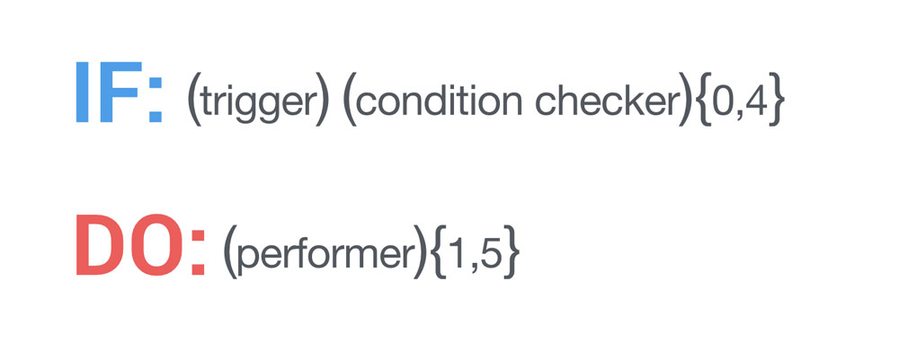

.. _core:

Core Concepts
=======================================

Target of this section is to provide a high level description of the core concepts behind the Atooma environment. Focus will be on **Modules** and their inner structure, with emphasis on how they can be used for building **Rules** to be executed.

Modules
------------------------------

**Modules** are sets of related functions packed into self-consistent software units, that are used for creating and executing rules. For example, ``SMS`` module includes functionalities for receiving, sending and managing messages, while ``WiFi`` module allows to control device WiFi features.

.. Every module includes a *version number*, reflecting changes on module structure (e.g. new features added, features removed due to deprecation and so on). This information is extremely important because it allows to define conditions for safely exchanging rules between different client versions.

Some modules may be not available on all devices. For example, if device lacks of ``NFC`` hardware, the corresponding module won’t be shown and, as a consequence, all rules including ``NFC`` module won't be executed.

Each module defines a set of components among the following: :ref:`corevaluetype` , :ref:`coretrigger` , :ref:`coreconditionchecker` and :ref:`coreperformer`. All of them are described more in details in the following sections.

.. _corevaluetype:

Value Type
^^^^^^^^^^^^^^^^^^^^^^^^^^^^^^
**Value Type** are components defining data types managed by the module. ``STRING``, ``BOOLEAN``, ``NUMBER`` and ``DATE`` are examples of basic value types defined in ``CORE`` module. Regardless of their internal representation, all value types must have a serialized format, allowing them to be exchanged as byte sequences, through a convention that must be specified by the value type definition itself.

..
	Provider
	^^^^^^^^^^^^^^^^^^^^^^^^^^^^^^
	**Providers** are components that provide values on demand to rules requiring them. For example, ``SYSTEM_TIME`` is a provider defined by ``Core`` module, that returns value of current system clock.

.. _coretrigger:

Trigger
^^^^^^^^^^^^^^^^^^^^^^^^^^^^^^
**Triggers** are rule activators. They are in charge of executing rules when specific events occur.

Each trigger can include parameters, allowing to configure rule activation in some conditions only. For example, ``SMS`` module defines a trigger ``INCOMING`` that is activated when an ``SMS`` is received. It's possible to filter events by monitoring only messages coming from a specific *sender*.

When activated, a trigger can inject values into the rule exectution context. For example ``INCOMING`` trigger of ``SMS`` module provides a set of information like message *content*, *sender* and so on.

.. _coreconditionchecker:

Condition Checker
^^^^^^^^^^^^^^^^^^^^^^^^^^^^^^
**Condition Checkers** are boolean functions accepting one or more parameters. They are used in conditional part of the rule for checking values. One example for ``WiFi`` module is ``CONNECTED``, that returns *true* if device is connected to ``WiFi`` with *SSID* name specified as parameter.

.. _coreperformer:

Performer
^^^^^^^^^^^^^^^^^^^^^^^^^^^^^^
**Performers** are components executing actions. For example, ``Facebook`` module has a performer ``POST_ON_WALL``, allowing to post a message provided in input on a friend's wall. Also performers can inject values into the rule execution context. Purpose is making such data avilable for the following performers.

.. note:: Rule performers are not executed in parallel. They are treated as a pipeline. That's why each element can receive parameters in input and produce parameters in output.

.. _rules:

Rules
------------------------------

**Rules** are programs defining actions to execute when a specific event occurs, according to an *if-do paradigm* where *if part* is made by one trigger and contains up to four condition checkers, while *do part* contains up to five perfomers.

In practice, *if-do parts* are contained in what is defined as **rule body**.

In addition to body, all rules include a **header**, declaring all basic rule information:

* A **title** for the rule (max 50 chars).
* An optional **description** of the rule (max 250 chars).
* The list of **modules** (with corresponding min version) that are needed for executing the rule.
* An optional list of **properties** to be used as parameters for the rule, each one including an **identifier**, a **value type** and a **value**.

Following sections provide advanced details on the structure of `Trigger`_, `Condition Checker`_ and `Performer`_ definitions.

.. _Trigger: core.html#coretriggerdef
.. _Condition Checker: core.html#coreconditioncheckerdef
.. _Performer: core.html#coreperformerdef

.. _coretriggerdef:

Trigger Definition
^^^^^^^^^^^^^^^^^^^^^^^^^^^^^^^^^^^^^^^^^^^^^^^^^^^^^

Trigger definition provides the configuration for the rule trigger. It includes three elements:

* The **module** implementing the trigger.
* The **identifier** of the trigger.
* The eventual **list of parameters** required by the trigger.

.. note:: Since rules are activated by triggers it's essential for them to define it.

.. _coreconditioncheckerdef:

Condition Checkers Definition
^^^^^^^^^^^^^^^^^^^^^^^^^^^^^^^^^^^^^^^^^^^^^^^^^^^^^

Condition checker definition provides the configuration for a condition to be verified within the execution context of the rule after trigger activation. It includes four elements:

* The **module** implementing the condition checker.
* The **identifier** of the condition checker.
* The eventual **list of parameters** required by the condition checker.
* The eventual **inversion of the boolean** result of the condition evaluation (``NOT`` operator).

.. note:: A rule can have up to four condition checkers, to be verified according to their declaration order. As soon as a condition evaluation returns *false*, the rule execution is interrupted. As a result, all subsequent conditions won't be evaluated and performers won't be executed.

.. _coreperformerdef:

Performers Definition
^^^^^^^^^^^^^^^^^^^^^^^^^^^^^^^^^^^^^^^^^^^^^^^^^^^^^

Performer definition provides the configuration for a performer to be executed in case trigger is activated and all conditions are verified. It includes three elements:

* The **module** implementing the performer.
* The **identifier** of the performer.
* The eventual **list of parameters** required by the performer.

.. note:: All rules must include at least one performer.

Parameters, Properties and Injected Values
^^^^^^^^^^^^^^^^^^^^^^^^^^^^^^^^^^^^^^^^^^^^^^^^^^^^^^^^^^^^^^^^

Defining trigger, condition checkers and performers may often require to use parameters, each one including an **identifier** and a **value type**.

There are four possible value sources for parameters:

* **Rule properties** - Properties declared within rule definition can be used as static parameter values.
* **Injection from trigger** - When activating the execution of a rule, a trigger can inject one or more variables into the rule execution context. Of course, such variables can be used by performers only.
* **Injection from performer** - During their execution, performers can inject one or more variables into the rule execution context. A variable coming from a performer can be used only after the execution of the performer that generated it.
* **External providers** - Static functions can be used for dynamically generating values for rule variables.

Of course depending on component, only some parameter sources can be used:

* **Triggers** - Parameters can be rule properties or values coming from external providers. In particular, every time a trigger parameter is read from an external provider with rule already active, the rule itself is reloaded into Atooma engine.
* **Condition Checkers** - Parameters can be rule properties, values coming from external providers or values injected from trigger.
* **Performers** - Parameters can be rule properties, values coming from external providers, values injected from trigger or values injected from other performers previously executed.

Data Analysis
------------------------------

On top of rules engine, Resonance SDK comes with a set of API allowing to build a detailed profile of user attitudes, providing to developers suitable functions for retrieving all user-related structured data.

Data Collector
^^^^^^^^^^^^^^^^^^^^^^^^^^^^^^^^^^^^^^^^^^^^^

Resonance Data Collector is the core components that allows to retrieve data from user devices, sending them anonymously to backend. It basically defines a set of events (triggers) at which a snapshot of device status is captured. Idea behind this approach is to avoid collecting data in case they are not significant, increasing sample rate in presence of more complex activities.

Below is reported a high level list of monitored events:

* **Activity Recognition** - Snapshot is taken every time an activity starts as well as every time an activity ends. This means that for each activity there is a couple of samples describing its start / end instances.

* **Rule Triggered** - Snapshot is taken every time an Atooma rule is triggered on device.

* **Headphone In/Out** - Snapshot is taken every time headphones are plugged in or out from device.

* **Airplane Mode On/Off** - Snapshot is taken every time airplane mode is enabled or disabled

* **WiFi Connect / Disconnect** - Snapshot is taken every time device connects to or disconnects from a WiFi network.

* **Bluetooth On / Off** - Snapshot is taken every time device bluetooth is turned on or off.

* **Bluetooth Connect / Disconnect** - Snapshot is taken every time device connect to or disconnects from a Bluetooth device.

* **Silent Mode On / Off** - Snapshot is taken every time device silent mode is enabled or disabled.

* **Call Started** - Snapshot is taken every time a phone call is started.

Depending on trigger, different data are collected. Below is reported the overall set of possible information to be retrieved when a device snapshot is taken:

* **Data Collector Version** - Since snapshots structure may change, it’s essential to include data collector version together with each sample that is delivered to server.

* **Device Id** - The unique id of device. It is computed as SHA-256 of hardware serial number. If not available, IMEI is hashed and in last instance WiFi network card MAC address.

* **Event** - This is the event type, defined according to triggers mentioned in previous section. Possible values are: ``bt_on``, ``bt_off``, ``wifi_connected``, ``wifi_disconnected``, ``silent_mode_on``, ``silent_mode_off``, ``airplane_mode_on``, ``airplane_mode_off``, ``headset_plugged``, ``headset_unplugged``, ``device_boot``, ``activity_start``, ``activity_end``, ``rule_triggered``

* **Location** - This data is structured for including different kinds of information. Not all the snapshots include Location details. In particular, location is included in Activity Start and WiFi Connected events only.

  * **GPS Position** - Latitude  and Longitude.

  * **GPS Accuracy** - Accuracy is the radius of 68% confidence. In other words, if you draw a circle centered at this location's latitude and longitude, and with a radius equal to the accuracy, then there is a 68% probability that the true location is inside the circle.

	* **Provider** - This is the source for GPS Position and Accuracy. Possible values are: network, gps, fused, atooma. More details will be provided in following sections.

	* **Speed** - Device Speed.

	* **Mobile Network Cell** - Cid  and Lac.

* **Detected Activities** - The list of detected activities with corresponding confidence.

* **Wifi Network** - The SSID of the WiFi network that device is connected to. ``not connected`` value is reported in case device is not connected to any WiFi network.

* **Date** - Snapshot registration date in format YYYY/MM/DD (e.g. 2015/06/26)

* **Time** - Snapshot registration time in format HH:MM, with hour from 0 to 23 (e.g. 14:56)

* **Battery** - Structured data with information about battery status. In particular:

  * **Level** - Battery percentage level

  * **Charging** - This field tells whether device is charging or not, including details on charging method. Possible values are: ``ac``, ``usb``, ``wireless`` and ``no``

* **Display On/Off** - Flag telling whether display is turned on or not.

* **Volume Level** - Level of volume

* **Paired Bluetooth Device** - Name of Bluetooth device that is currently paired

* **In Call** - Flag telling whether device is in call or not

* **Light Sensor** - Display Brightness percentage

Below is reported an example of snapshot that is sent to Resonance Backend.

.. code-block:: json
  :linenos:

  {
    "activity": {
      "activities": {
	      "still": 100
      },
      "duration": 0,
      "start": 1433488539012
    },
    "battery": {
      "charging": "usb",
      "level": 28
    },
    "event": "activity_start",
    "location": {
    	"accuracy": 1454.0,
      "cid": 9735713,
      "lac": 23060,
      "lat": 46.0643252,
      "lon": 11.1247105,
      "provider": "network",
      "speed": 0.0
    },
    "date": "2015/06/05",
    "time": "09:15",
    "timezone" : "0200",
    "wifi": "not_connected"
  }

Please notice that in order to reduce device load, collected snapshots are sent in blocks to backend.
