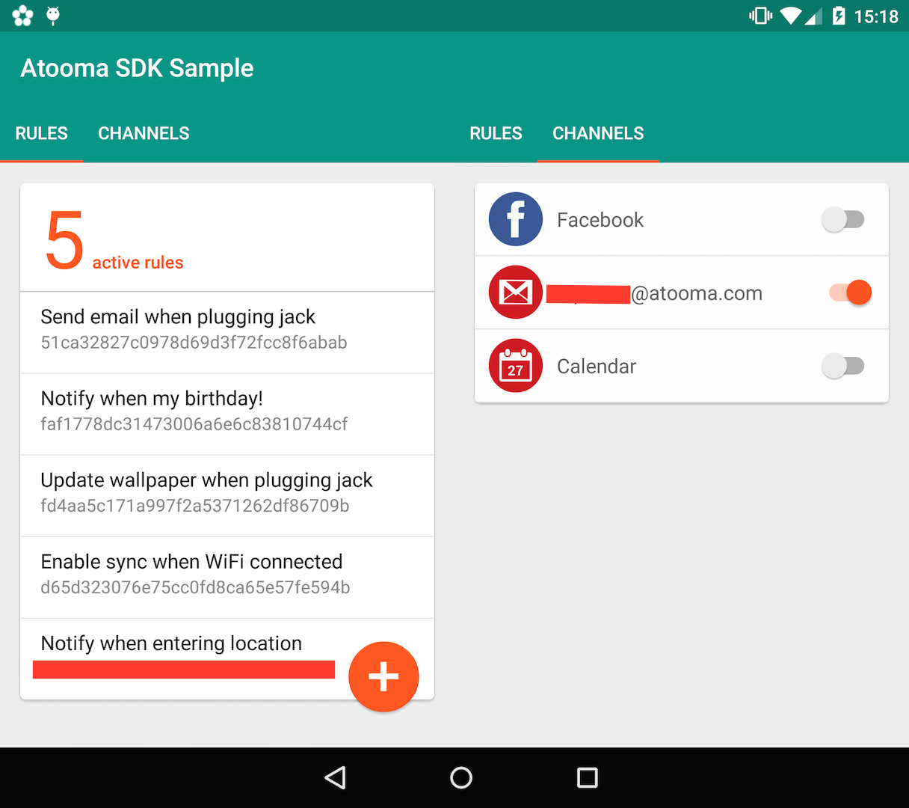
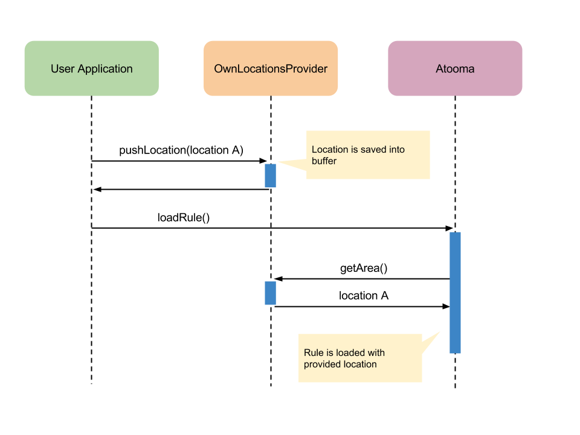

.. _examples:

Examples
=======================================

Target of this section is providing some examples, showing in depth how Atooma SDK can be used for simplifying development of specific tasks.

.. note:: Code for all examples is available `here <https://github.com/atooma/atooma-engine-sdk-samples>`_ on GitHub.

Initializing the environment
---------------------------------------

In order to use Atooma SDK, few steps are required for initializing the environment within own application. As a first step, ``build.gradle`` script in your ``app`` module requires to include following *dependencies*:

.. code-block:: groovy
  :linenos:

  compile 'com.atooma:engine:1.0.6'
  compile 'com.atooma:engine-modules:1.0.8'

Moreover, top level ``build.gradle`` file must include credentials for accessing to Atooma packages:

.. code-block:: groovy
  :linenos:

  allprojects {
    repositories {
      jcenter()
        maven {
          url  "http://atooma.bintray.com/engine"
            credentials {
              username 'YOUR USERNAME'
              password 'YOUR PASSWORD'
            }
        }
    }
  }

Please notice that you will get credentials by following instructions reported in section :ref:`intro-needs`.

.. _Rule Definition: #ruledefinition

.. _ruledefinition:

The *RuleDefinition* Class
---------------------------------------

Rules are represented within the execution engine by using instances belonging to the ``RuleDefinition`` class. Going in depth with details about its implementation is not essential. What is important is to understand is how to get a ``RuleDefinition`` instance starting from its XML representation.

For such purpose, Atooma SDK provides an important utility, the ``XMLDeserializer``, that is a class implementing useful methods for properly deserializing XML files. In particular static method ``deserialize`` allows to get a ``RuleDefinition`` instance, starting from its XML representation, as shown below:

.. code-block:: java
  :linenos:

  // getting rule definition with provided id
  RuleDefinition def_1 = XMLDeserializer.deserialize(stream, id);

  // getting rule definition with automatically generated id
  RuleDefinition def_2 = XMLDeserializer.deserialize(stream);

As you can see, two methods are defined for deserializing an XML stream and building the corresponding ``RuleDefinition`` object. Main difference is represented by the possibility of manually defining an identifier for the rule.

Rule identifiers are extremely important because they are used as keys within rule execution engine. This means that same rule can be loaded twice in case of different identifier, while it is loaded only once in case identifier is the same. Be aware that asking ``XMLDeserializer`` to automatically assign a rule identifier has the effect of generating a UUID value for it. That's why it's commonly preferred to define a custom strategy for assigning identifiers to rules (e.g. using an hash of rule title can be a simple example).

The *Atooma* Class
---------------------------------------

Working with Atooma Rules Engine requires developers to use ``Atooma`` singleton class, that is the main interface for accessing all core Atooma features and functionalities, such as loading and unloading rules.

It follows a list of the main methods and properties that can be used for properly configuring and exploiting Atooma class:

.. code-block:: java
  :linenos:

  /**
   * Initialize the engine, loading all provided modules.
   */
  void start(Module[] module)

  /**
   * Load a rule into the Atooma engine, starting from the corresponding
   * xml stream. Returns true in case operation is completed successfully,
   * false otherwise.
   */
  boolean loadRule(InputStream stream, RuleConflictsChecker checker)

  /**
   * Load a rule into the Atooma engine, starting from its Rule Definition.
   * Returns true in case operation is completed successfully, false otherwise.
   */
  void loadRule(RuleDefinition def, RuleConflictsChecker checker)

  /**
   * Returns a map with all active rule definitions, having rule ids
   * as keys.
   */
  Map<String,RuleDefinition> getActiveRules()

  /**
   * Unload rule from engine basing on its id and stopping its execution.
   */
  boolean unloadRule(RuleDefinition def)

  /**
   * Returns true if engine is inited, false otherwise.
   */
  boolean isEngineInited()

  /**
   * Stops engine execution.
   */
  void halt()

The *RuleConflictsChecker* Class
---------------------------------------

Atooma doesn't impose any constraint on rules creation. It means that users / developers can create even rules with potential inconsistencies. For example, let's consider the rule: **IF** (WiFi ON, WiFi OFF) **DO** (Notification Toast). Of course, such rule will never fire, because it implements two opposing conditions.

In order to handle such kind of situations, Atooma provides an extendible class, that is ``RuleConflictsChecker``. Such class is responsible for checking whether a rule loading may create problems or not. In particular, there are two possible high level conflicts to be taken into account:

1. **Internal Conflicts** - An internal conflict occurs when the definition of a rule prevent it from firing (as in the example described before).

2. **External Conflicts** - An external conflict occurs when the definition of a rule has components that can interfere with other rule definitions.

``RuleConflictsChecker`` class implements following methods for encapsulating the whole conflicts verification logic:

.. code-block:: java
  :linenos:

    /**
     * Adds a checker for internal conflicts.
     */
    void addInternalChecker(RuleInternalConflictsChecker checker);

    /**
     * Adds a checker for external conflicts.
     */
    void addExternalChecker(RuleExternalConflictsChecker checker);

    /**
     * Checker for internal conflicts within provided
     * RuleDefinition. true is returned in case rule
     * can be activated anyway, false otherwise.
     */
    boolean checkInternalConflicts(RuleDefinition def);

    /**
     * Checker for external conflicts between provided
     * RuleDefinition and all the other active rules.
     * true is returned in case rule can be activated
     * anyway, false otherwise.
     */
    boolean checkExternalConflicts(RuleDefinition def);

    /**
     * Checker for external conflicts between provided
     * RuleDefinition and the other rules in input.
     * true is returned in case rule can be activated
     * anyway, false otherwise.
     */
    boolean checkExternalConflicts(RuleDefinition def, Collection<RuleDefinition> defs);

Basing on signatures reported above, it is clear that ``RuleConflictsChecker`` class requires additional checkers to be provided to it in order to implement the overall conflicts verification strategy. Purpose of ``RuleInternalConflictsChecker`` and ``RuleExternalConflictsChecker`` classes is to provide an abstraction for internal and external conflict concepts. Providing new conflict verification criteria means extending such classes, by implementing following methods:

.. code-block:: java
  :linenos:

  //RuleInternalConflictsChecker
  abstract boolean hasConflicts(RuleDefinition def);

  // RuleExternalConflictsChecker
  abstract boolean haveConflicts(RuleDefinition def, RuleDefinition other);

Please notice that all conflict checkers are created by providing a boolean parameter that is used for declaring whether rule must be activated regardless outcome of conflicts verification or not.

Let's suppose we would like to check whether multiple rules share the same trigger. Below is reported sample code for implementation of the corresponding ``RuleExternalConflictsChecker``:

.. code-block:: java
  :linenos:

  public class SameTriggerConflictsChecker extends RuleExternalConflictsChecker {

    public SameTriggerConflictsChecker(boolean activateAnywayay) {
      super(activateAnywayay);
    }

    @Override
    protected boolean haveConflicts(RuleDefinition def, RuleDefinition other) {
      TriggerDefinition tr1 = def.getTriggerDefinition();
      TriggerDefinition tr2 = other.getTriggerDefinition();
      // In case rule we are going to activate has same trigger
      // of another active rule, there can be unexpected behaviors
      return tr1.getModule().equals(tr2.getModule()) && tr1.getId().equals(tr2.getId());
    }

  }

In terms of usage, below is reported sample code for activating a rule taking care of multiple conflict verification criterias:

.. code-block:: java
  :linenos:

  RuleConflictsChecker checker = new RuleConflictsChecker();
  checker.addExternalChecker(new SameTriggerConflictsChecker(true));
  // ...
  Atooma.with(context).loadRule(def, checker);

About Opposite Conditions
^^^^^^^^^^^^^^^^^^^^^^^^^^^^^^^^^^^^^^^

Atooma SDK provides implementation for two conflict checkers:

* ``SameTriggerConflictsChecker`` extending ``RuleExternalConflictsChecker``

* ``OppositeConditionsConflictsChecker`` extending ``RuleInternalConflictsChecker``

First one was already discussed in previous section, while second one requires some insights. Starting from version 1.0.7, Atooma engine includes a mechanism for easily declaring component that can be considered as opposite. In practice it's enough to use the following declaration in own modules:

.. code-block:: java
  :linenos:

  /**
   * Declares to components as opposite by specifying their ids.
   */
  void registerOppositeConditions(String idOne, String idTwo);

By default following rules are already defined for all modules, including the custom ones created by developers:

.. code-block:: java
  :linenos:

  /**
   * Such declarations must be used within
   * registerComponents method for new modules.
   */
  registerOppositeConditions("ENABLED", "DISABLED");
  registerOppositeConditions("CONNECTED", "DISCONNECTED");
  registerOppositeConditions("ON", "OFF");

Example 0 - Basic Usage
---------------------------------------

Let's suppose we would like to create a simple rule allowing to show a toast notification when connecting to a specific WiFi network.

Atooma SDK already provides a couple of modules that can be combined for such scope: :ref:`module-wifi` and :ref:`module-notification`. It's easily possible to exploit them for building the rule described by the XML below:

.. code-block:: xml
  :linenos:

  <?xml version="1.0" encoding="UTF-8" standalone="yes"?>
  <rule xmlns="http://www.atooma.com/sdk/rule" version="1">
    <title>Notify when connecting to WiFi</title>
    <description>Shows a notification when connecting to WiFi</description>
    <required-module version="1" id="CORE" />
    <required-module version="1" id="WIFI" />
    <required-module version="1" id="NOTIFICATION" />
    <property literal="string" typeId="STRING" typeModule="CORE" id="par-0">
      home_wifi
    </property>
    <property literal="string" typeId="STRING" typeModule="CORE" id="par-1">
      Connected to home WiFi!
    </property>
    <trigger id="CONNECTED" module="WIFI">
      <parameter id="SSID">
        <property-ref id="par-0" />
      </parameter>
    </trigger>
    <performer id="TOAST" module="NOTIFICATION">
      <parameter id="TEXT">
        <property-ref id="par-1" />
      </parameter>
    </performer>
  </rule>

For having such rule running on a own application, it's commonly enough to implement an *Application* class similar to the one reported below:

.. code-block:: java
  :linenos:

  public class WhiteLabelApplication extends Application {

    @Override
    public void onCreate() {
      super.onCreate();
      // starting rules engine (if needed)
      if (!Atooma.with(this).isEngineInited()) {
        // getting core modules
        Module[] modules = Modules.getBasicModules();
        // initializing Atooma engine
        Atooma.with(this).init(context, MainActivity.class, modules);
        // loading specific rules from assets folder
        loadRule("wifi_notification.xml");
      }
    }

    /**
     * Support method allowing to load a rule from assets.
     */
    private void loadRule(String rule) {
      // trying to load all rules
      try {
        // loading xml with rule definition
        InputStream stream = getAssets().open(xml);
        // loading rule definition from xml
        Atooma.with(this).loadRule(stream);
      } catch (IOException ex) {
        Log.e("Atooma", "unable to open xml from assets: " + xml);
      }
    }

  }

Example 1 - External Providers
--------------------------------------------

Let's now suppose we would like to take rule previously defined and dynamically adapt WiFi network name to device / user. In such case we cannot statically define it within rule definition. We need instead to use a proper provider class and use it as reported in the example below:

.. code-block:: xml
  :linenos:

  <?xml version="1.0" encoding="UTF-8" standalone="yes"?>
  <rule xmlns="http://www.atooma.com/sdk/rule" version="1">
    <title>Notify when connecting to home WiFi</title>
    <description>Shows a notification when connecting to home WiFi</description>
    <required-module version="1" id="CORE" />
    <required-module version="1" id="WIFI" />
    <required-module version="1" id="NOTIFICATION" />
    <property literal="string" typeId="STRING" typeModule="CORE" id="par-1">
      Connected to home WiFi!
    </property>
    <trigger id="CONNECTED" module="WIFI">
      <parameter id="SSID">
        <external-provider-call
          className="com.atooma.sample.WiFiProvider"
          methodName="getSSID" />
      </parameter>
    </trigger>
    <performer id="TOAST" module="NOTIFICATION">
      <parameter id="TEXT">
        <property-ref id="par-1" />
      </parameter>
    </performer>
  </rule>

WiFi network name will be defined by using static method ``getSSID()`` from class ``WiFiProvider``, that will be implemented as follows:

.. code-block:: java
  :linenos:

  public class WifiProvider {

    public static VT_String_Wrapper getSSID() {
      String ssid = getHomeWiFi();
      return new VT_String_Wrapper(ssid);
    }

    private static String getHomeWiFi() {
      String ssid = "";
      // logic for getting home wifi name here
      // (e.g. from shared preferences or sqlite)
      return ssid;
    }

  }

Please notice that class ``VT_String_Wrapper`` is a wrapper for ``STRING`` data type, defined within Atooma SDK.

.. _examples-two:

Example 2 - Custom Modules
---------------------------------------

Let's suppose we would like to create an application allowing to change device wallpaper when plugging headphones. Wallpaper should be defined according to current location.

Basing on provided description, this is just a simple rule with one trigger and one performer:

* Event condition is already handled by Atooma SDK through the :ref:`module-headphone` module, so we don't need to implement anything.
* Performer part requires the implementation of a dedicated module. We can think about an integration with ``FLICKR``, allowing to get photos from a specific Flickr group, basing on location coordinates provided by devices.

Analyzing in depth the implementation of backend is out of our scope. Let's just imagine to have the following endpoint, working as an indirection between Android clients and Flickr server:

.. code-block:: java

	GET http://www.mydomain.coma/api/flickr/pictures/<lat>/<lon>

What we need to do is defining a proper Flickr module, implementing one single component, that is the required performer ``PE_Wallpaper``.

.. code-block:: java
  :linenos:

  public class _FLICKR extends Module {

    private static final String MODULE_ID = "FLICKR";

    private static final int MODULE_VERSION = 1;

    public _FLICKR() {
      super(MODULE_ID, MODULE_VERSION);
    }

    @Override
    protected void declareDependencies() {
      declareDependency("CORE", 1);
    }

    @Override
    protected boolean init() {
      return true;
    }

    @Override
    protected void registerComponents() {
      registerPerformer("WALLPAPER", 1, new PE_SetWallpaper());
    }

    @Override
    protected void destroy() {
    }

  }

Rule definition will be as follows:

.. code-block:: xml
  :linenos:

  <?xml version="1.0" encoding="UTF-8" standalone="yes"?>
  <rule xmlns="http://www.atooma.com/sdk/rule" version="1">
    <title>Wallpaper on demand</title>
    <description>Update wallpaper when plugging headphone</description>
    <required-module version="1" id="CORE" />
    <required-module version="1" id="HEADPHONE" />
    <required-module version="1" id="FLICKR" />
    <trigger id="HEADPHONE-PLUGGED" module="HEADPHONE" />
    <performer id="WALLPAPER" module="FLICKR" />
  </rule>

For details on the implementation of requested Flickr performer you can refer to code available `here <https://github.com/atooma/atooma-engine-sdk-samples>`_ on GitHub.

Modules with Authentication
^^^^^^^^^^^^^^^^^^^^^^^^^^^^^^^^^^^^^^^

Let's suppose we would like to implement a module as an integration for an external service (e.g. Facebook, Gmail and so on). In such case it's always essential to include an implementation for the authentication workflow (commonly based on OAuth).

Atooma SDK comes with some classes allowing to simplify management of such workflow, providing some utilities for activating / deactivating external services connection as well as for checking whether connection is active or not.

.. code-block:: java
  :linenos:

  /**
   * Class used for handling connection / disconnection operations,
   * with reference to a specific external service, called Channel.
   */
  abstract class ChannelHandler

  /**
   * Class used for representing an Atooma Module implementing
   * an integration with an external service, so requiring a
   * dedicated ChannelHandler to be provided.
   */
  abstract class ChannelModule

  /**
   * Singleton class used for managing all available
   * channel handlers.
   */
  class ChannelsManager

Let's go in depth with ``ChannelHandler`` first. Following methods must be implemented:

.. code-block:: java
  :linenos:

  /**
   * Returns the id of module that this ChannelHandler is
   * aimed to handle.
   */
  abstract protected String getModuleId();

  /**
   * Execute code for connecting to Channel. This commonly
   * consists in access to a specific authentication Activity.
   */
  abstract protected void doConnection(Activity source);

  /**
   * Implements logic for extracting token and username
   * from result intent.
   */
  abstract protected void extractAndSaveDataFromResult(Context context, Intent data);

Additional methods are available for getting information like stored token.

It follow a sample implementation for Gmail:

.. code-block:: java
  :linenos:

  @Override
  protected void doConnection(Activity source) {
    Intent intent = new Intent(source, GmailActivity.class);
    source.startActivityForResult(intent, 8888);
  }

  @Override
  public boolean isConnected(Context context) {
    return !TextUtils.isEmpty(getToken(context));
  }

  @Override
  protected String getModuleId() {
    return "GMAIL";
  }

  @Override
  protected void extractAndSaveDataFromResult(Context context, Intent data) {
    // getting params
    String username = data.getStringExtra(GoogleOAuth2Activity.PARAM_EMAIL);
    String token = data.getStringExtra(GoogleOAuth2Activity.PARAM_TOKEN);
    // store params
    saveUser(context, username);
    saveToken(context, token);
  }

Moving to ``ChannelModule`` class, it's just important to properly implement following abstract methods:

.. code-block:: java
  :linenos:

  /**
   * Returns the id of the ChannelHandler. It's common
   * to use module id for this step.
   */
  abstract protected String getChannelHandlerKey();

  /**
   * Returns a ChannelHandler instance.
   */
  abstract protected ChannelHandler buildChannelHandler();

In case of Gmail we'll have something like this:

.. code-block:: java
  :linenos:

  @Override
  protected String getChannelHandlerKey() {
    return Channels.GMAIL;
  }

  @Override
  protected ChannelHandler buildChannelHandler() {
    return new GmailChannelHandler();
  }

As already discussed, purpose of ``ChannelHandler`` classes is not only to activate / deactivate a connection. They can also be used through ``ChannelHandler`` for checking whether a channel is activated or not. This is essential when trying to load a rule that include modules interacting with external services. Of course in case some channels are not activated it's possible that rule cannot be activated too.

Below is reported a code excerpt, showing how to activate rules depending on used modules:

.. code-block:: java
  :linenos:

  //...

  Atooma atooma = Atooma.with(context);
  ChannelsManager cm = ChannelsManager.with(context);
  try {
      if (atooma.getActiveRules().containsKey(id)) {
          Log.d(LOG_TAG, "already active rule: " + xml);
          return;
      }
      // loading xml with rule definition
      InputStream stream = context.getAssets().open(xml);
      // building rule definition
      RuleDefinition def = XMLDeserializer.deserialize(stream, id);
      if (cm.isActivable(def)) {
          // loading rule definition into engine
          atooma.loadRule(def);
          Log.d(LOG_TAG, "activated rule: " + xml);
      } else {
          Log.d(LOG_TAG, "unable to activate rule: " + xml);
      }
  } catch (IOException ex) {
      Log.e(LOG_TAG, "unable to open xml from assets: " + xml);
  } catch (XMLRuleException ex) {
      Log.e(LOG_TAG, "unable to deserialize xml: " + xml);
  }

Example 3 - XML As A Template
---------------------------------------

Let's suppose we would like to implement an application allowing to show a notification when entering into specific locations (e.g. Home, Work and so on). Application will expose a single ``Activity`` allowing to check active rules and create new rules based on current location, as reported in the screenshot below.

Of course we can rely on existing modules :ref:`module-location` and :ref:`module-notification` for implementing logic, but here we are going to use a rule definition in XML format as a template for multiple rules, instead of building just a simple rule definition from it.

Using an XML as a template requires data to be dynamic and External Providers are the right mechanism for dealing with dynamic data. Our XML will be as follows:

.. code-block:: xml
  :linenos:

  <?xml version="1.0" encoding="UTF-8" standalone="yes"?>
  <rule xmlns="http://www.atooma.com/sdk/rule" version="1">
    <title>Notify when entering location</title>
    <description>-</description>
    <required-module version="1" id="CORE" />
    <required-module version="3" id="LOCATION" />
    <required-module version="1" id="NOTIFICATION" />
    <trigger id="IN" module="LOCATION">
      <parameter id="AREA">
        <external-provider-call
          className="com.atooma.sdk.samples.providers.OwnLocationsProvider"
          methodName="getArea" />
      </parameter>
    </trigger>
    <performer id="TOAST" module="NOTIFICATION">
      <parameter id="TEXT">
        <external-provider-call
          className="com.atooma.sdk.samples.providers.NotificationsProvider"
          methodName="getMessage" />
      </parameter>
    </performer>
  </rule>

The real issue here is understanding how to handle locations as well as to ensure that multiple rule definitions are created from XML basing on such locations:

* :ref:`xml-template-strategy` describes an effective strategy for exploiting an XML template, handling corresponding rules data.
* :ref:`xml-template-classes` provides details on SDK classes, preventing developer from dealing with complexity of template data management.

.. _xml-template-strategy:

Strategy In Depth
^^^^^^^^^^^^^^^^^^^^^^^^^^^^^^^^^^^^^^^^^^^^^^^^^^^^^^^^^^^^

As a first step we can proceed by exploiting ``LocationsManager`` class that is available in :ref:`commons`. Once local storage is populated with some location objects, what we can easily do is defining a method iterating over all locations and loading rules from XML template into the execution engine.

.. code-block:: java
  :linenos:

  /**
   * Support method for loading location based rules
   * starting from locations provider
   */
  public static void loadLocationRules(Context context, String template) {
    try {
      // getting singleton for accessing locations provider
      LocationsManager lm = LocationsManager.getInstance();
      // getting list of locations
      List<LocationWrapper> locations = lm.readLocationsList(context);
      // iterating over locations
      for (LocationWrapper location : locations) {
        // loading rule based on location
        loadRule(context, template, location);
      }
    } catch (AuthorityNotSetException ex) {
      Log.e(LogTags.LOCATION, ex.getMessage(), ex);
    }
  }

Let's now go in depth with definition of ``loadRule`` method reported in code above. Idea is quite simple. Since we need to load rules one by one, it's enough to push each location into a queue handled by the ``OwnLocationsProvider`` class (that is the external provider class reported in the XML) and then to request Atooma SDK to load the rule. When building it, ``getArea`` method within ``OwnLocationsProvider`` will be invoked, returning the head of the queue.

Below is reported the implementation of the method.

.. code-block:: java
  :linenos:

  /**
   * Support method for loading a location based rule encoded
   * by the provided xml template into engine, returning a
   * boolean value telling if operation was successfully
   * completed or not.
   */
  public static boolean loadRule(Context context, String xml, LocationWrapper location) {
    // can activate rule?
    if (OwnLocationsProvider.pushLocation(location)) {
      // we are using a template, so we must use location
      // as seed for building rule id
      String id = MD5.compute(xml) + location.getLabel();
      loadRule(context, xml, id);
      return true;
    }
    return false;
  }

Please notice that here we are using a custom identifier for rules, that is made by combining a hash of rule title (that is always the same since we are using the same XML template) with location label. With this strategy we are sure that same rule (or better, same rule on same location) won't be loaded twice.

Here it is the implementation of the ``OwnLocationsProvider`` class:

.. code-block:: java
  :linenos:

  public class OwnLocationsProvider {

    private static final String LOG_TAG = "Location";

    /**
     * Collection used for putting locations to be used
     * as output for getArea method
     */
    private static List<LocationWrapper> LOCATIONS_QUEUE = new ArrayList<>();

    /**
     * Collection used for putting locations already used in
     * with current rule
     */
    private static List<LocationWrapper> ACTIVE_RULES = new ArrayList<>();

    /**
     * Provider method used in xml rule location_notification.xml
     */
    public static VT_Area_Wrapper getArea() {
      LocationWrapper wrapper = popLocation();
      if (wrapper != null) {
        return new VT_Area_Wrapper(wrapper);
      } else {
        Log.e(LOG_TAG, "missing location parameter");
        return null;
      }
    }

    /**
     * Add a location to the collection storing the ones
     * to be used for activating rules
     */
    public static synchronized boolean pushLocation(LocationWrapper location) {
      // putting in queue just in case rule doesn't exist yet
      boolean toPush = !ACTIVE_RULES.contains(location);
      if (toPush) {
        ACTIVE_RULES.add(location);
        LOCATIONS_QUEUE.add(location);
      }
      return toPush;
    }

    /**
     * Get a location from the collection storing the ones
     * to be used for activating rules, then removes it from
     * such collection
     */
    public static synchronized LocationWrapper popLocation() {
      LocationWrapper location = null;
      int index = LOCATIONS_QUEUE.size() - 1;
      if (index >= 0) {
        location = LOCATIONS_QUEUE.get(index);
        LOCATIONS_QUEUE.remove(index);
      }
      return location;
    }

  }

.. _xml-template-classes:

SDK Classes
^^^^^^^^^^^^^^^^^^^^^^^^^^^^^^^^^^^^^^^^^^^^^^^^^^^^^^^^^^^^

Dealing with rules data in case of XML templates may be tricky. That's why Atooma SDK comes with some useful classes that help developers with such task. Please notice that these classes are available starting from SDK libraries version 1.0.1.

Let's suppose we would like to handle location based rules mentioned in previous section. What we need to do is to extend following classes:

.. code-block:: java
  :linenos:

  /**
   * Representation of template rules data. In our case, implementation
   * of this class should include just management of a Location object.
   */
  class TemplateRule

  /**
   * Representation of the queue for rules data. It mus implement
   * method getWrapperObjects, that is aimed to provide a map with
   * all values to be pushed into rule with an external provider call.
   */
  class TemplateRuleDataQueue<T extends TemplateRule>

  /**
   * Representation of the storage for rules data. It is
   * currently implemented by using SharedPreferences, but
   * in future multiple implementations will be provided.
   */
  class TemplateDataStorageHelper<T extends TemplateRule>

Below is reported implementation for all classes mentioned above:

.. code-block:: java
  :linenos:

  public class LocationRuleData extends TemplateRule {

    private LocationWrapper mLocation;

    public LocationRuleData(String id, String template, LocationWrapper location) {
      super(id, template);
      mLocation = location;
    }

    public LocationWrapper getLocation() {
      return mLocation;
    }

    @Override
    protected TemplateRuleDataQueue getQueue() {
      // let's suppose to exploit a singleton implementation
      return LocationRuleDataQueue.getInstance();
    }

    @Override
    protected TemplateDataStorageHelper getStorageHelper() {
      // let's suppose to exploit a singleton implementation
      return LocationRuleStorageHelper.getInstance();
    }

  }

.. code-block:: java
  :linenos:

  public class LocationRuleDataQueue extends TemplateRuleDataQueue<LocationRuleData> {

    public static final String LOCATION_PARAM = "location";

    // ...

    @Override
    protected Map<String,ValueTypeWrapper> getWrapperObjects(LocationRuleData item) {
      Map<String,ValueTypeWrapper> wrappers = new TreeMap<>();
      wrappers.put(LOCATION_PARAM, new VT_Area_Wrapper(item.getLocation()));
      return wrappers;
    }

  }

.. code-block:: java
  :linenos:

  public class LocationRuleStorageHelper extends TemplateDataStorageHelper<LocationRuleData> {

    // ...

    @Override
    protected String getStorageFilename() {
      return "locations";
    }

    @Override
    protected Class<LocationRuleData[]> getItemArrayClass() {
      return LocationRuleData[].class;
    }

  }

On top of these classes, below is shown the implementation of External Provider static class.

.. code-block:: java
  :linenos:

  public class LocationRuleProvider {

    public static VT_Area_Wrapper getArea(String ruleId) {
      VT_Area_Wrapper wrapper = (VT_Area_Wrapper) LocationRuleDataQueue.getInstance()
        .getParamWrapper(ruleId, LocationRuleDataQueue.LOCATION_PARAM);
      return wrapper;
    }

  }
